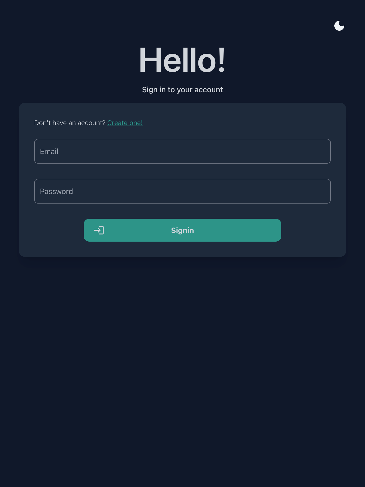
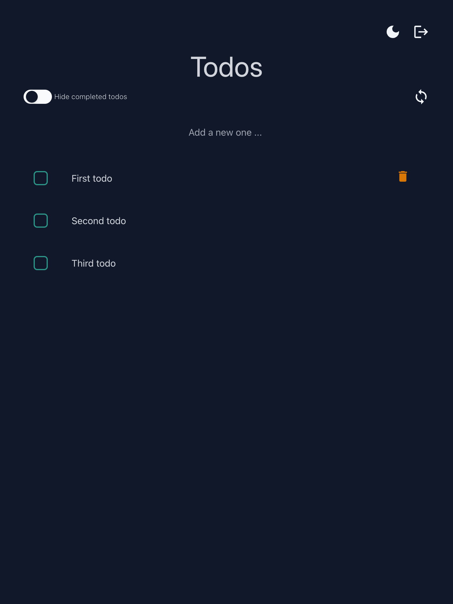
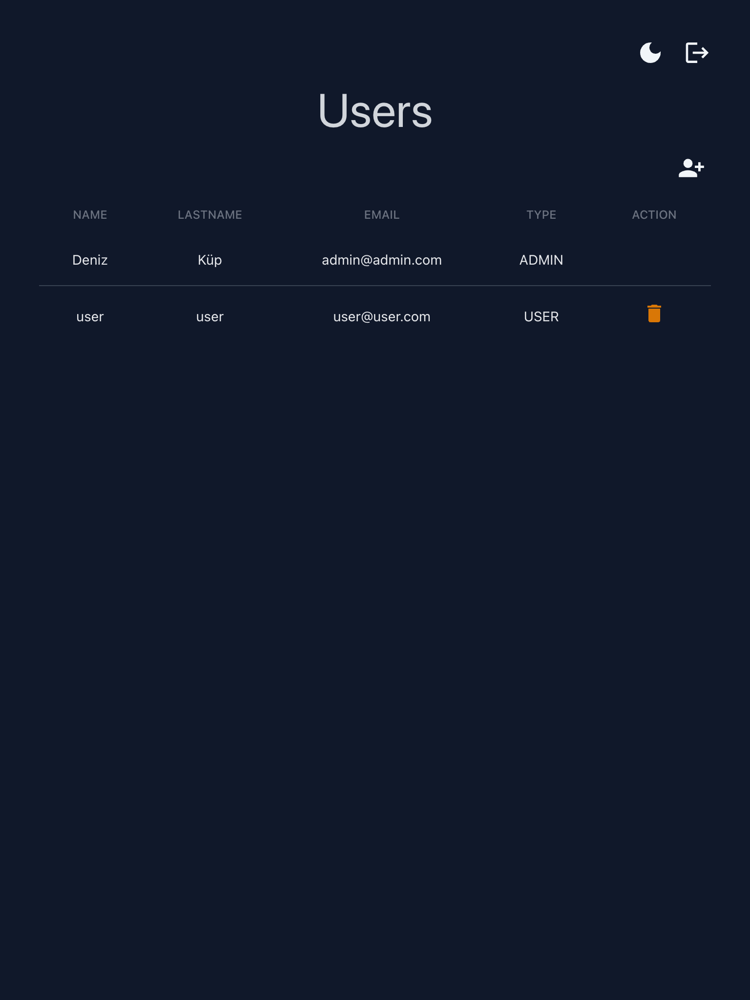
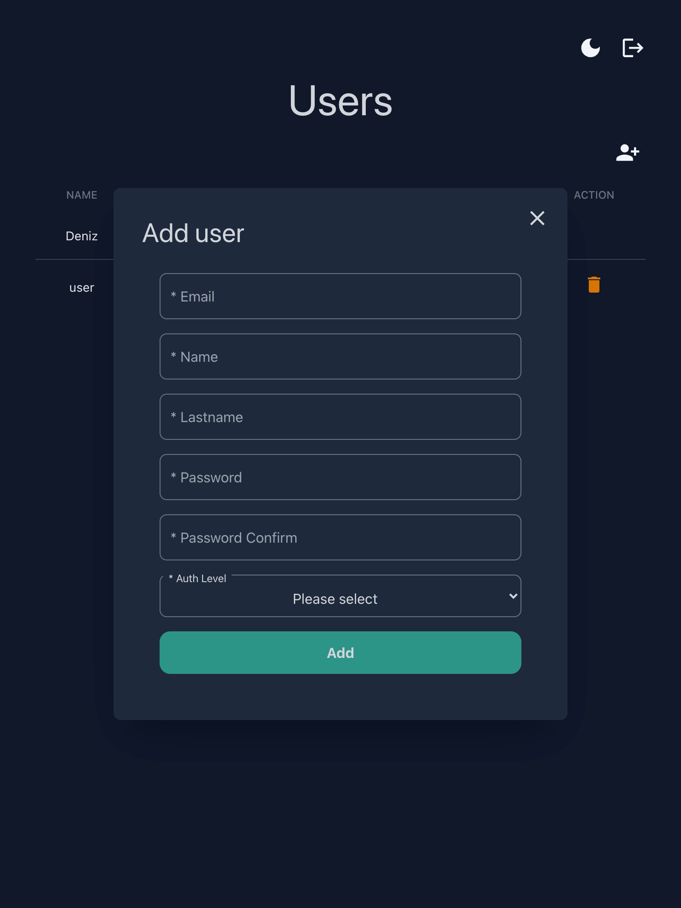
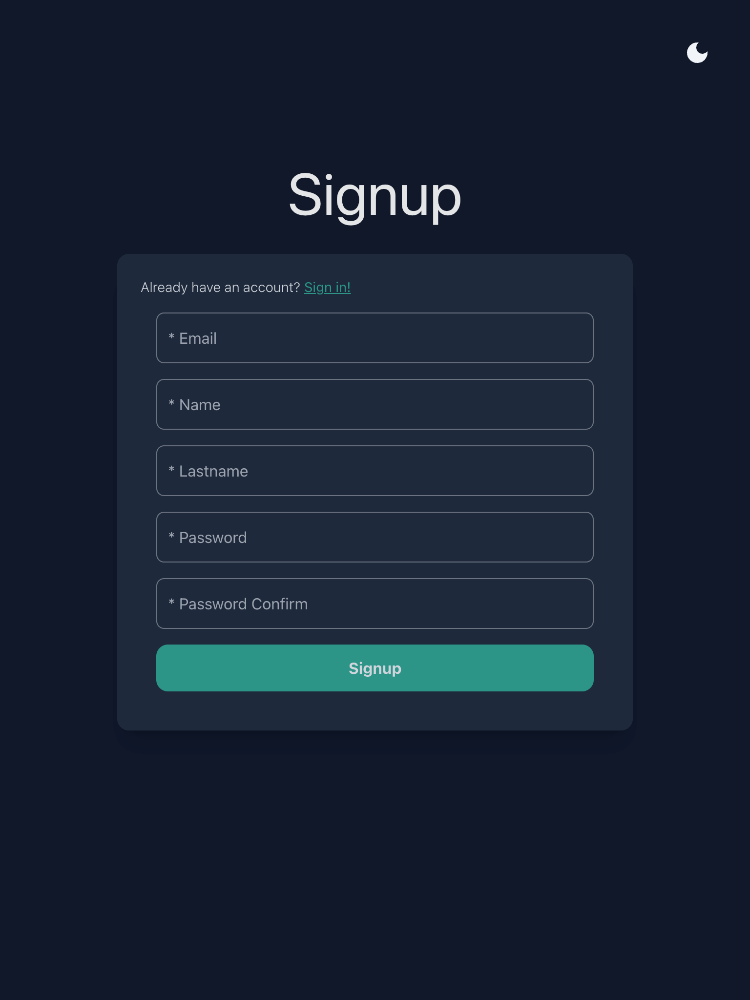

# Todo app with backend and user authentication
This is a simple todo app with backend to authentication and save todos. I'm just trying to learn typescript,react and nodejs essentials by doing this project.

### Screenshots
<div style="display:flex align-items:center justify-content:center ">





</div>


> Note: I'm suck at designing.

### Backend
It contains user authentication with cookies and session. Users, todos and sessions are stored in the MongoDB with using mongoose.
It has 2 authorization level 'ADMIN' and 'USER'. A user can signup with using signup page and a admin should be created manually in MongoDB document.
Sessions are stored in MongoDB and when a user is signed in it save to the sessions document and it will be deleted when user is logged out.

## Scripts
To run available scirpt
```bash
    npm run 'script_name'
```
Available scripts:

    start:dev  -> To run in development mode with nodemon
    start:prod -> To run in production
    build:dev  -> To build for development
    build:prod -> To build for production
    test       -> To run all tests with jest

### Frontend
Typescirpt and React based UI with Taiilwind CSS. To create the project Vite is used. It contains theme and authorization hooks to control theme and check for authorization level with respect to current page. ADMIN is only see the users list and USER only see todo page.

To run 
```bash
    npm run dev
```